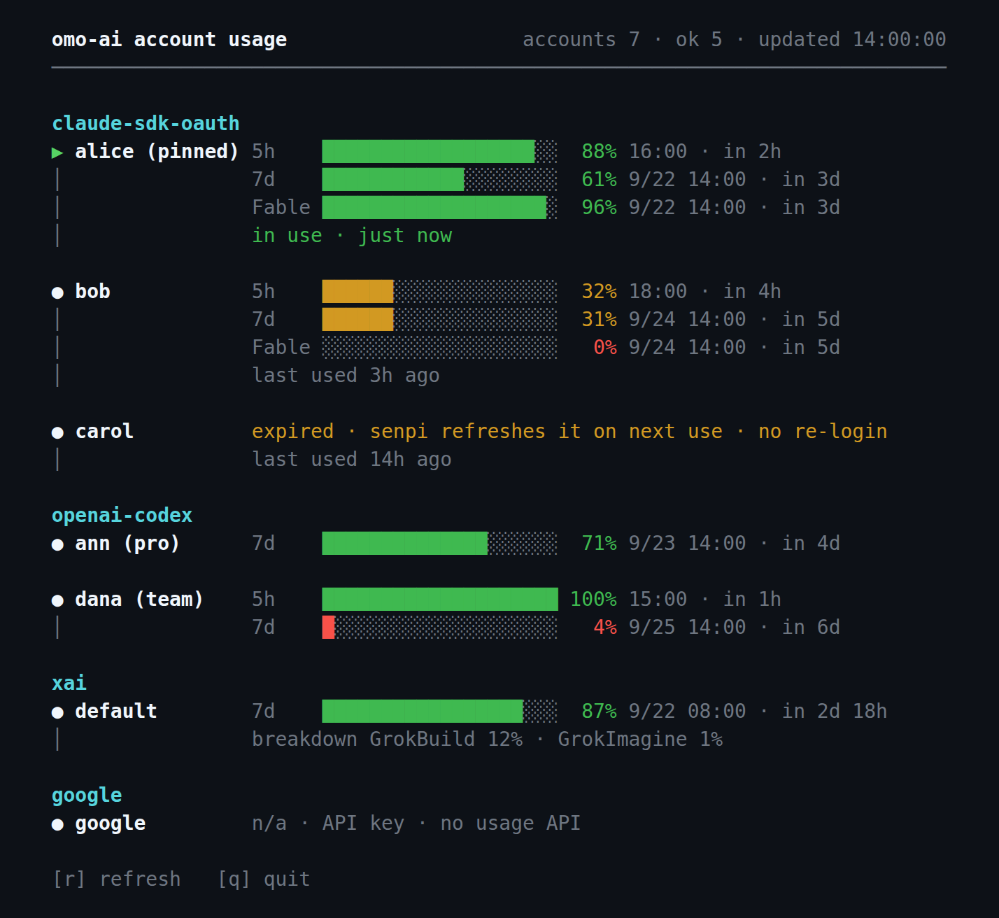

# omo-usage

omo-ai(senpi)에 로그인된 **모든 계정의 잔여 사용량**과 **지금 차감 중인 계정**을 한 화면에서 보는 터미널 UI.

[](LICENSE)
[](https://bun.sh)
[](#빠른-시작)

<p align="center">
  
</p>

<details>
<summary>텍스트 버전 (위 화면과 같은 데모 데이터)</summary>

```
  omo-ai 계정 사용량                               계정 7 · 정상 5 · 갱신 14:00:00
  ────────────────────────────────────────────────────────────────────────────────

  claude-sdk-oauth
  ▶ alice (고정) 5h    ██████████████████░░  88% 16:00 · 2시간 뒤
  │              7d    ████████████░░░░░░░░  61% 9/22 14:00 · 3일 뒤
  │              Fable ███████████████████░  96% 9/22 14:00 · 3일 뒤
  │              사용 중 · 방금

  ● bob          5h    ██████░░░░░░░░░░░░░░  32% 18:00 · 4시간 뒤
  │              7d    ██████░░░░░░░░░░░░░░  31% 9/24 14:00 · 5일 뒤
  │              Fable ░░░░░░░░░░░░░░░░░░░░   0% 9/24 14:00 · 5일 뒤
  │              마지막 사용 3시간 전

  ● carol        만료 · senpi가 사용 시 자동 갱신 · 재로그인 불필요
  │              마지막 사용 14시간 전

  openai-codex
  ● ann (pro)    7d    ██████████████░░░░░░  71% 9/23 14:00 · 4일 뒤

  ● dana (team)  5h    ████████████████████ 100% 15:00 · 1시간 뒤
  │              7d    █░░░░░░░░░░░░░░░░░░░   4% 9/25 14:00 · 6일 뒤

  xai
  ● default      7d    █████████████████░░░  87% 9/22 08:00 · 2일 18시간 뒤
  │              사용 내역 GrokBuild 12% · GrokImagine 1%

  google
  ● google       n/a · API key · 사용량 API 없음

  [r] 새로고침   [q] 종료
```

</details>

senpi에 Claude·Codex·xAI 계정을 여러 개 물려 쓰다 보면 "지금 어느 계정이 얼마나 남았지?", "지금은 어느 계정을 쓰고 있지?"를 매번 확인하기 번거롭다. omo-usage는 senpi가 저장한 자격증명과 계정 풀 상태를 **읽기만** 해서 계정별 잔여 비율·리셋 시각과 지금 차감 중인 계정을 한 번에 보여준다. 토큰은 절대 화면·출력·로그에 나오지 않고, 응답을 해석할 수 없으면 숫자를 지어내는 대신 사유를 적는다.

## 빠른 시작

**필요한 것**: [Bun](https://bun.sh) ≥ 1.2, 그리고 omo-ai(senpi) 로그인 (`~/.omo/agent/auth.json`).

```sh
bun add -g github:orientpine/omo-usage   # 또는: npm i -g github:orientpine/omo-usage
omo-usage
```

업데이트도 같은 명령을 다시 실행하면 된다. 제거는 `bun remove -g @orientpine/omo-usage`.

> [!NOTE]
> 코드가 Bun 전용(`Bun.file`, `Bun.argv`, 빌드 없이 `.ts` 실행)이라 npm으로 설치해도 실행은 bun이 한다. senpi 자체가 bun 위에서 돌기 때문에 senpi 사용자는 추가로 깔 것이 없다.

## 어떻게 동작하나

```
~/.omo/agent/auth.json                  ─ 읽기만 ─▶ 계정 로스터 ─▶ provider별 usage API ─▶ 잔여 막대 · 리셋 시각
~/.omo/agent/credential-pool-state.json ─ 읽기만 ─▶ 슬롯별 lastSuccessAt ─▶ ▶ 사용 중 · 마지막 사용
```

senpi가 쓰는 두 파일을 열어 볼 뿐 한 바이트도 쓰지 않는다. 토큰 갱신과 계정 선택은 전부 senpi 몫이라 omo-usage를 켜 둔다고 senpi 동작이 바뀌지 않는다. 사용량은 150초마다 다시 조회하고(Anthropic의 429 쿨다운보다 길게), 차감 중 표시는 로컬 파일 하나라 5초마다 다시 읽는다.

## 사용법

| 명령 | 동작 |
| --- | --- |
| `omo-usage` | TUI. 사용량은 150초마다, 차감 중 표시(`▶`)는 5초마다 갱신. `r` 즉시 갱신, `q` / `Ctrl-C` 종료 |
| `omo-usage --once` | 한 번 조회해 한 줄씩 출력하고 종료 |
| `omo-usage --json` | 같은 결과를 JSON으로 출력 (토큰 없음) |
| `omo-usage --help` | 도움말 |
| `omo-usage \| cat` | 파이프로 넘기면 TUI 대신 프레임을 한 번만 출력 |

### 화면 읽는 법

- **한 계정 = 한 블록.** 첫 줄 `●` 뒤에 계정 이름(Codex는 `(pro)`/`(team)` 플랜, auth.json이 고정한 슬롯은 `(고정)`), 이어지는 창은 `│`로 묶인다.
- **지금 차감 중인 계정은 `▶`다.** senpi가 최근 10분 안에 그 계정으로 요청을 성공시켰으면 마커가 초록 `▶`가 되고 블록 끝에 `사용 중 · 방금`이 붙는다. 더 오래됐으면 `●` 그대로에 dim `마지막 사용 3시간 전`. senpi는 세션마다 계정을 따로 고르므로 `▶`가 둘 이상일 수 있다. Codex·xAI는 senpi가 이 기록을 남기지 않으므로 TUI가 직전 조회와 잔여를 비교해 줄어든 만큼을 `사용 중 · 방금 조회에서 -3%`로 적는다 — 근거가 다르니 문구도 다르다(정확한 시각이 아니라 150초 조회 주기 안 어딘가이고, Codex는 정수 %라 1%p 미만은 안 잡힌다). 오래되면 `마지막 차감 감지 25분 전`. `--once`/`--json`은 직전 조회가 없어 이 표시가 없다. google은 사용량 API 자체가 없다.
- **막대와 %는 남은 양이다.** 100%가 아직 하나도 안 쓴 상태. 초록 ≥ 50% · 노랑 ≥ 20% · 빨강 < 20%.
- **창 이름**: `5h` 세션, `7d` 주간, `Fable`처럼 모델 이름이 붙으면 그 모델의 주간 한도.
- **리셋 시각**은 오늘이면 `16:00`, 아니면 `9/22 14:00`, 그 뒤에 `2시간 뒤` 같은 상대 시간.
- **xAI**는 주간 크레딧 풀 하나가 막대가 되고, 그 아래 `사용 내역 GrokBuild 12% · GrokImagine 1%`는 같은 풀에서 제품별로 쓴 몫이다(잔여가 아니라 사용).
- 막대 대신 사유가 뜨는 경우:

| 표시 | 뜻 |
| --- | --- |
| `만료 · senpi가 사용 시 자동 갱신 · 재로그인 불필요` | 액세스 토큰만 만료. senpi가 그 계정을 쓰는 순간 refresh token으로 갱신한다 |
| `만료 · refresh 실패 · omo에서 /login <provider> (이름: <슬롯>)` | refresh token까지 죽은 경우. omo TUI에서 `/login`으로 재인증 |
| `요청 제한 (HTTP 429) · HH:MM 재시도` | 직전 막대를 그대로 두고, 그 시각 전에는 다시 부르지 않는다 |
| `오류 · …` | HTTP 오류·시간 초과·해석 불가 응답. 숫자를 지어내지 않는다 |
| `n/a · …` | 사용량 API가 없는 provider(google) |

### JSON 출력

`--json`은 계정 배열을 준다. 토큰·이메일은 들어가지 않는다.

```json
[
  {
    "provider": "claude-sdk-oauth",
    "slot": "default",
    "label": "alice",
    "status": "ok",
    "detail": null,
    "plan": null,
    "expiresAt": 1789840800000,
    "windows": [
      { "label": "5h", "kind": "session", "remainingPercent": 88, "resetsAt": 1789830000000 },
      { "label": "7d", "kind": "weekly", "remainingPercent": 61, "resetsAt": 1790082000000 },
      { "label": "Fable", "kind": "scoped", "remainingPercent": 96, "resetsAt": 1790082000000 }
    ],
    "pinned": true,
    "lastUsedAt": 1789822760000
  }
]
```

- `status`: `ok` · `expired` · `error` · `unsupported`. `detail`은 사유 문자열(없으면 `null`).
- `windows[].kind`: `session`(5h) · `weekly`(7d) · `scoped`(모델별) · `other`. 시각은 전부 epoch ms.
- `lastUsedAt`: senpi가 그 계정으로 마지막으로 성공한 요청 시각(epoch ms, `~/.omo/agent/credential-pool-state.json`의 `lastSuccessAt`). 기록이 없는 provider(Codex·xAI·google)에는 키 자체가 없다. `pinned: true`는 auth.json이 그 슬롯을 고정한 경우에만 붙는다. Codex·xAI의 잔여 감소 감지(`drained`)는 직전 조회가 있어야 생기므로 TUI에서만 붙고 `--json`에는 나오지 않는다.
- 429로 이전 값을 유지 중이면 `retryAt`, xAI 제품별 내역은 `note`가 추가로 붙는다.

```sh
# 예: 계정별 7d 잔여만
omo-usage --json | jq -r '.[] | select(.status=="ok") | "\(.provider)/\(.label)\t\(.windows[] | select(.label=="7d") | .remainingPercent)%"'

# 예: 지금 차감 중인 계정 (최근 10분)
omo-usage --json | jq -r --argjson now "$(date +%s000)" '.[] | select(.lastUsedAt != null and $now - .lastUsedAt < 600000) | .label'
```

## FAQ

**지금 senpi가 어느 계정을 차감하고 있는지 알 수 있나?**
`▶`가 붙은 계정이다. senpi는 요청이 성공할 때마다 `~/.omo/agent/credential-pool-state.json`에 그 슬롯의 `lastSuccessAt`을 적고, omo-usage는 그 값이 10분 이내인 슬롯을 `사용 중`으로 표시한다. TUI는 이 파일만 5초마다 다시 읽으므로 사용량 조회 주기(150초)와 무관하게 바로 따라온다. "지금 이 계정 하나"라고 단정하지 않는 이유가 있다: senpi는 세션마다 해시로 계정을 고르고(고정 계정이 있으면 그것을 우선), 세션이 여럿이면 여러 계정이 동시에 차감된다. 그래서 `▶`는 둘 이상일 수 있고, 옆의 `방금`·`3분 전`이 판단 근거다. Codex·xAI는 senpi가 이 기록을 남기지 않는다(`openai-codex/stored/slots`가 비어 있고 xai는 항목 자체가 없다). 그래서 TUI는 그 둘을 직전 조회와 잔여를 비교하는 방식으로 대신한다 — 잔여가 줄었으면 `▶ … 사용 중 · 방금 조회에서 -3%`. 정확한 시각이 아니라 150초 조회 주기 안 어딘가이며, 리셋으로 잔여가 느는 건 차감으로 치지 않는다. google은 사용량 API가 없다.

**"만료"라는데 다시 로그인해야 하나?**
대개 아니다. 액세스 토큰 만료는 정상이고, refresh token이 살아 있으면 senpi가 그 계정을 다음에 쓰는 순간 자동 갱신한다. omo-usage는 auth.json을 읽기만 하므로 갱신을 대신 해 주지 못하고(직접 refresh하면 refresh token이 회전돼 senpi 저장본이 깨진다) 만료 상태를 그대로 보여줄 뿐이다. 재로그인이 필요한 건 `refresh 실패`가 붙은 경우뿐이며, 그때는 omo TUI에서 `/login claude-sdk-oauth`를 실행하고 이름 프롬프트에 기존 슬롯 이름을 입력하면 제자리에서 교체된다.

**`omo auth login` 같은 셸 명령은 없나?**
없다. `omo auth`에는 `check` / `print-api-key` / `print-bearer-token`뿐이다. 로그인은 TUI 안의 `/login <provider>` 또는 `/claude-account add`다.

**계정마다 `요청 제한 (HTTP 429)`가 자주 뜬다.**
Anthropic usage 엔드포인트는 토큰당 마지막 성공 뒤 약 95초 동안 429를 돌려준다. senpi 자체 폴링과 겹치면 더 잦다. omo-usage는 429를 받으면 직전 막대를 유지하고 재시도 시각 전에는 그 계정을 다시 부르지 않으며, 자동 갱신 주기(150초)도 이 쿨다운보다 길게 잡았다. 값이 사라지는 게 아니라 잠시 안 바뀌는 것뿐이다.

**xAI 제품별 내역은 왜 막대가 아닌가?**
`GrokBuild 12% · GrokImagine 1%`는 각 제품의 한도가 아니라 같은 주간 풀에서 쓴 몫이라, 잔여 막대로 그리면 뜻이 틀린다. 막대는 풀 전체(`creditUsagePercent`) 하나만 둔다.

**토큰이 어디로 새지는 않나?**
auth.json은 읽기 전용으로 열고, 토큰은 fetch 호출에만 쓴다. 화면 상태(`AccountRow`)에는 토큰이 아예 들어가지 않으므로 `--json`에도 나올 수 없다. 이 도구는 auth.json에 한 바이트도 쓰지 않는다.

## 지원 provider

| provider | 보여주는 것 | 어디서 |
| --- | --- | --- |
| `claude-sdk-oauth` | 계정별 5h / 7d / 모델별 주간 한도 | `GET https://api.anthropic.com/api/oauth/usage` (`anthropic-beta: oauth-2025-04-20`) |
| `openai-codex` | 계정별 5h / 7d + 플랜 | `GET https://chatgpt.com/backend-api/wham/usage` (`ChatGPT-Account-Id`는 액세스 토큰 JWT에서 추출) |
| `xai` | 주간 크레딧 풀 잔여 + 제품별 내역 | `GET https://cli-chat-proxy.grok.com/v1/billing?format=credits` — Grok CLI `/usage`와 같은 엔드포인트. omo의 xai 토큰이 Grok CLI와 같은 OIDC 클라이언트로 발급돼 베어러만으로 통과 |
| `google` | — (`n/a`) | 공개된 사용량 API 없음 |

## 설계 원칙

- **숫자를 지어내지 않는다.** 응답이 비었거나 형식이 다르면 막대 대신 사유를 보여준다.
- **auth.json에 쓰지 않는다.** 토큰 갱신은 senpi 몫이다.
- **만료 ≠ 죽음.** 재로그인 안내는 senpi failover가 `blockReason: "auth_error"`로 찍은 슬롯에만 붙인다.
- **"현재 계정" 하나를 단정하지 않는다.** senpi의 계정 선택은 세션별이라, 슬롯마다 마지막 차감 시각을 그대로 보여주고 최근(10분)이면 `▶`로 부른다. 근거가 다르면 문구도 다르다(`방금` vs `방금 조회에서 -3%`).
- **429에 막대를 지우지 않는다.** 직전 값 유지 + 재시도 시각 표시 + 그 전엔 호출 안 함.
- **한 줄도 터미널 폭을 넘지 않는다.** 한글·전각 폭을 직접 계산해 색을 입혀도 열이 흔들리지 않는다.

<details>
<summary>구현 메모 (응답 형식의 함정들)</summary>

- **Codex 창은 위치가 아니라 길이로 구분한다.** 플랜에 따라 `primary_window`가 주간이기도 5시간이기도 해서 `limit_window_seconds`(18000 / 604800)로 판별한다.
- **Claude 모델별 주간 한도는 `limits[]`의 `weekly_scoped`에만 있다.** `seven_day_opus` 같은 최상위 키는 대개 `null`.
- **xAI 응답은 proto3 JSON이라 0은 키가 빠진다.** `config.currentPeriod`가 있는데 `creditUsagePercent`만 없으면 0(잔여 100%)으로 읽고, `currentPeriod` 자체가 없으면 크레딧 응답이 아니므로 `오류`로 둔다. `{"val":0}`은 `{}`로 온다.
- **Anthropic 429 창은 토큰당 약 95초**(2026-09-18 실측). `Retry-After`가 있으면 그 값을, 없으면 120초를 쿨다운으로 쓴다.
- **xAI 슬롯의 라벨은 `default`다.** senpi가 xai에는 displayName을 저장하지 않는다.
- **차감 기록은 `credential-pool-state.json`에만 있다.** `providers.<provider>.lanes.stored.slots.<슬롯>.lastSuccessAt`이 요청 성공마다 갱신된다. `lease`는 half-open 프로브 잠금(30초)이라 사용 중 신호가 아니다. 옛 슬롯 이름·계정 id 키가 잔재로 남아 있어 현재 auth.json 슬롯 이름으로만 대조하고, Codex 슬롯은 이 파일에 아예 없다(xai는 provider 항목 자체가 없다). 그래서 이 둘은 TUI 갱신 사이의 잔여 감소로 대신한다 — `collect.ts`가 직전 결과의 `remainingPercent`를 창 라벨별로 비교해 줄어든 최대 폭을 `drained`로 남기고, 잔여 증가(리셋)는 감지하지 않으며 새 감지가 없으면 직전 감지를 유지한다.

</details>

## 개발

```sh
git clone https://github.com/orientpine/omo-usage && cd omo-usage
bun install
bun test              # 테스트 (실제 응답을 익명화한 픽스처)
bun run typecheck     # tsc --noEmit
bun run src/main.ts   # 로컬 실행 (= bin/omo-usage.ts)
```

```
src/
  main.ts         CLI 진입: --once / --json / --help, 아니면 TUI
  tui.ts          대체 화면, 키 입력, 150초 자동 갱신, 5초 pool-state 갱신, 429 재시도 예약
  collect.ts      provider별 fetch, 429 쿨다운, 직전 조회 대비 잔여 감소 감지
  parse.ts        응답 → UsageWindow (Claude / Codex / xAI)
  auth.ts         auth.json → 계정 로스터, 만료 판정과 사유, 고정 슬롯
  pool.ts         credential-pool-state.json → 슬롯별 마지막 차감 시각 (▶ 사용 중)
  credentials.ts  토큰 맵 (화면 상태와 분리)
  render.ts       프레임 렌더: 폭 계산, 색, ● / ▶ / │ 가이드
  types.ts        AccountRow, UsageWindow
```

## 라이선스

[MIT](LICENSE)
